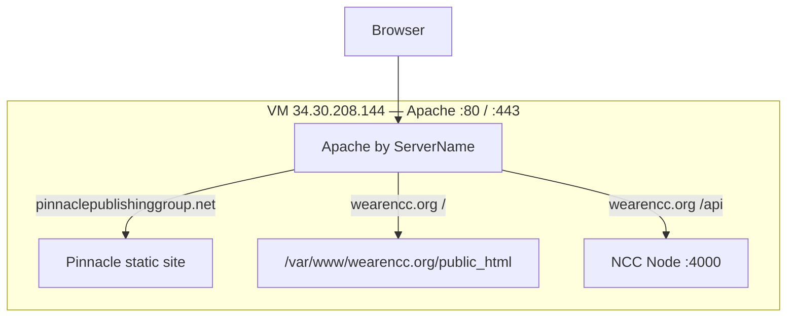

# NCC documentation

| Guide | Use when |
|-------|----------|
| [deploy-ubuntu-wearencc.md](./deploy-ubuntu-wearencc.md) | **Production (start here)** — step-by-step: file map, upload order, API `.env`, Apache, admin setup |
| [production-runtime.md](./production-runtime.md) | **Live server reference** — NVM Node 24, GLIBC notes, verified endpoints, redeploy commands |
| [../CHANGELOG.md](../CHANGELOG.md) | Production overhaul changelog (May 2026) |
| [../deploy/CHECKLIST.md](../deploy/CHECKLIST.md) | Printable phase checklist (same deploy, one page) |
| [deploy-cpanel.md](./deploy-cpanel.md) | Shared hosting with cPanel and reverse proxy to Node |
| [placeholder-keys.md](./placeholder-keys.md) | `data-ph` placeholder keys and site-config fields |
| [admin-phase2-plan.md](./admin-phase2-plan.md) | Planned admin enhancements |

## Quick architecture

On the shared VM, **Apache** serves both domains with **Certbot** TLS. NCC pages live under `/var/www/wearencc.org/public_html`; the API runs from `/var/www/wearencc.org/backend` with `/api` proxied by Apache. Node **v24.16.0** runs via **NVM** + **PM2** (Ubuntu 18.04 — not `apt` Node).

**Live:** https://wearencc.org/ · Health: `/api/health` · Status: `/api/public/status`
