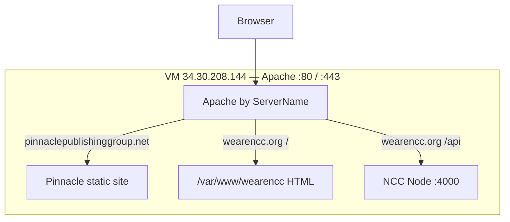

# NCC documentation

| Guide | Use when |
|-------|----------|
| [deploy-ubuntu-wearencc.md](./deploy-ubuntu-wearencc.md) | **Production (start here)** — step-by-step for zero experience: file map, upload order, API `.env`, Apache, SSL, admin setup |
| [../deploy/CHECKLIST.md](../deploy/CHECKLIST.md) | Printable phase checklist (same deploy, one page) |
| [deploy-shared-server-ssl.md](./deploy-shared-server-ssl.md) | HTTPS troubleshooting supplement (Apache, not nginx) |
| [deploy-cpanel.md](./deploy-cpanel.md) | Shared hosting with cPanel and reverse proxy to Node |
| [placeholder-keys.md](./placeholder-keys.md) | `data-ph` placeholder keys and site-config fields |
| [admin-phase2-plan.md](./admin-phase2-plan.md) | Planned admin enhancements |

## Quick architecture

On the shared VM, **Apache** terminates TLS for **both** domains. NCC static files live under `/var/www/wearencc`; `/api` is proxied to Node on localhost. `assets/config/runtime.json` sets `"apiBase": "/api"`.
