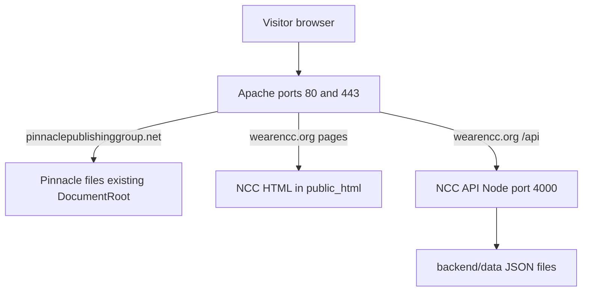

# Complete deployment guide (beginner-friendly)

**Production status (May 2026):** **https://wearencc.org/** is live on VM `instance-20260502-213133`. This guide remains the reference for redeploys, new servers, and disaster recovery. Runtime details (NVM, GLIBC, verified endpoints): **[production-runtime.md](./production-runtime.md)**.

Follow this document **in order** from top to bottom. You do not need prior Linux or server experience.

**Your server today**

| Item | Value |
|------|--------|
| Google Cloud VM name | `instance-20260502-213133` |
| Public IP | `34.30.208.144` |
| NCC website folder on server | **`/var/www/wearencc.org/public_html`** (web) + **`/var/www/wearencc.org/backend`** (API) |
| Pinnacle (booksales) | **`/var/www/pinnaclepublishinggroup.net`** — do not delete or move |
| NCC API (Node.js) | Runs on `127.0.0.1:4000` via **NVM Node 24.16.0** + **PM2** (not `apt` Node) |
| TLS / SSL | **Already configured** via **Certbot + Apache** (`certbot --apache`) for both domains — skip initial cert steps during NCC deploy |

**What you are building**



---

## Table of contents

1. [Words you will see](#1-words-you-will-see)
2. [What runs where (file map)](#2-what-runs-where-file-map)
3. [Before you start (checklist)](#3-before-you-start-checklist)
4. [Phase A — DNS and Google Cloud firewall](#phase-a--dns-and-google-cloud-firewall)
5. [Phase B — Log into the server (SSH)](#phase-b--log-into-the-server-ssh)
6. [Phase C — Install required software](#phase-c--install-required-software)
7. [Phase D — Upload the NCC project to the server](#phase-d--upload-the-ncc-project-to-the-server)
8. [Phase E — Create config files on the server (not in Git)](#phase-e--create-config-files-on-the-server-not-in-git)
9. [Phase F — Install and start the NCC API (backend)](#phase-f--install-and-start-the-ncc-api-backend)
10. [Phase G — Tell Apache about wearencc.org](#phase-g--tell-apache-about-wearenccorg)
11. [Phase H — Final tests in the browser](#phase-h--final-tests-in-the-browser)
12. [Phase I — First admin login and site settings](#phase-i--first-admin-login-and-site-settings)
13. [Phase J — Updating the site later (redeploy)](#phase-j--updating-the-site-later-redeploy)
14. [Troubleshooting](#troubleshooting)
15. [Quick reference tables](#quick-reference-tables)

---

## 1. Words you will see

| Term | Meaning |
|------|---------|
| **VM** | Your virtual computer in Google Cloud (`34.30.208.144`). |
| **SSH** | Secure way to type commands on the VM from your PC. |
| **DNS** | Maps `wearencc.org` to your VM IP (like a phone book). |
| **Apache** | Web server that sends out your HTML pages and HTTPS. |
| **Node / API / backend** | Program that powers admin login, calendar API, prayer chat, uploads. |
| **PM2** | Keeps the Node API running after you close SSH. |
| **NVM** | Node Version Manager — installs Node in your home directory (required on Ubuntu 18.04; do not use `apt install nodejs`). |
| **DocumentRoot** | Public web folder Apache serves (here: `/var/www/wearencc.org/public_html`). |
| **Virtual host (vhost)** | Apache config for one domain name. |
| **Certbot** | Let’s Encrypt client used with Apache (`certbot --apache`) to issue and renew HTTPS certificates. |
| **ProxyPass** | Apache forwards `/api` requests to Node on port 4000. |

---

## 2. What runs where (file map)

### 2.1 On the server after a full NCC deploy

This VM uses a **split layout** (Apache `DocumentRoot` = `public_html`; API outside the web root):

```
/var/www/wearencc.org/
├── public_html/          ← Apache serves this (HTML, CSS, JS)
│   ├── index.html
│   ├── assets/
│   └── *.html
├── backend/              ← Node API (not public)
└── deploy/               ← scripts from repo
```

| What visitors use | Server path | Comes from |
|-------------------|-------------|------------|
| Home page | `/var/www/wearencc.org/public_html/index.html` | Your Git repo |
| All public pages | `/var/www/wearencc.org/public_html/*.html` | Your Git repo |
| Styles / scripts | `/var/www/wearencc.org/public_html/assets/` | Your Git repo |
| Calendar XML (fallback) | `/var/www/wearencc.org/public_html/assets/data/events.xml` | Your Git repo |
| **Browser API address** | `/var/www/wearencc.org/public_html/assets/config/runtime.json` | **You create on server** |
| Staff admin page | `/var/www/wearencc.org/public_html/admin.html` | Your Git repo |

| What the API uses | Server path | Comes from |
|-------------------|-------------|------------|
| API program | `/var/www/wearencc.org/backend/src/server.js` | Your Git repo |
| Dependencies | `/var/www/wearencc.org/backend/node_modules/` | `npm install` on server |
| **Secrets & admin password** | `/var/www/wearencc.org/backend/.env` | **You create on server** |
| Events database | `/var/www/wearencc.org/backend/data/events.json` | API / import script |
| Site config | `/var/www/wearencc.org/backend/data/site-config.json` | Admin save |
| Uploaded files | `/var/www/wearencc.org/backend/uploads/` | Staff uploads |

| Apache system files (copied from repo once) | Server path | Repo source file |
|---------------------------------------------|-------------|------------------|
| NCC vhost | `/etc/apache2/sites-available/wearencc.org.conf` | `deploy/apache/wearencc.org.conf` |

| PM2 (process manager) | | |
|-----------------------|--|--|
| PM2 config | Uses `deploy/ecosystem.config.cjs` from repo | `deploy/ecosystem.config.cjs` |

### 2.2 Pinnacle (booksales) — leave as-is

Pinnacle files stay in **`/var/www/pinnaclepublishinggroup.net`**. **Do not** put Pinnacle inside `/var/www/wearencc.org`.

Find live vhost paths:

```bash
sudo apache2ctl -S
grep -E 'DocumentRoot|ProxyPass' /etc/apache2/sites-enabled/wearencc.org*.conf
grep -E 'DocumentRoot' /etc/apache2/sites-enabled/pinnaclepublishinggroup.net*.conf
```

### 2.3 Files you do **not** upload to the server

| Do not upload | Why |
|---------------|-----|
| `.git/` | Not needed to run the site; wastes space. |
| `backend/node_modules/` | Rebuilt on server with `npm install`. |
| `backend/.env` | Create fresh secrets on the server only. |
| `assets/config/runtime.json` | Create on server from the example file. |
| `backend/data/*.json` with real data from your PC | Server creates its own production data. |
| `under-construction.html` | Removed; not used in production. |

---

## 3. Before you start (checklist)

- [ ] You can log into [Google Cloud Console](https://console.cloud.google.com/).
- [ ] VM **instance-20260502-213133** is running and IP is **34.30.208.144**.
- [ ] You have the NCC project on your computer (Git clone or ZIP).
- [ ] Domain **wearencc.org** (and **www**) DNS points to **34.30.208.144** (done if propagation is complete).
- [ ] You chose a **strong admin password** (you will type it into `backend/.env` on the server).
- [ ] You ran the **server audit** (below) and know which deploy phases are already complete.

**Estimated time:** 1–2 hours first time (less if Apache, Node, PM2, and TLS are already on the VM).

**Already done on this VM:** HTTPS for **wearencc.org** and **pinnaclepublishinggroup.net** was issued with **Let’s Encrypt via Certbot** (`sudo certbot --apache`) and lives in each site’s Apache config under `/etc/apache2/sites-available/`. This guide does not repeat those steps.

**If you only renew or replace certs later:** `sudo certbot renew --dry-run` then `sudo certbot renew` (Certbot auto-renew is usually enabled by the package).

### Verified state on this VM (production — May 2026)

| Item | Status on `instance-20260502-213133` |
|------|--------------------------------------|
| DNS | Done (both domains → this server) |
| Apache | **2.4.29** — ports **80** and **443** listening |
| Certbot | **0.27.0** — one cert for all four hostnames |
| Pinnacle files | **`/var/www/pinnaclepublishinggroup.net`** |
| NCC web root | **`/var/www/wearencc.org/public_html`** — deployed |
| NCC API folder | **`/var/www/wearencc.org/backend`** — deployed |
| Apache `ProxyPass /api` | **Configured** on HTTP + HTTPS vhosts |
| Node.js | **v24.16.0** via **NVM** (Ubuntu 18.04 — do not use `apt install nodejs`) |
| PM2 | **`ncc-backend` online** |
| NCC API (:4000) | **Running** — `curl https://wearencc.org/api/health` → `{"status":"ok"}` |
| Public status | **`/api/public/status`** → `{"status":"operational"}` |

**Redeploys:** use [Phase J](#phase-j--updating-the-site-later-redeploy). **New server:** start at Phase C (NVM + PM2), skip Certbot if certs exist.

### Pre-overhaul audit snapshot (2026-05-30 — historical)

Before the May 2026 system overhaul, the VM had Apache + TLS but no Node/PM2/API proxy. That gap drove the NVM + GLIBC + code fixes documented in [production-runtime.md](./production-runtime.md) and [CHANGELOG.md](../CHANGELOG.md).

### Server audit (run first — no guessing)

SSH into the VM, then use **one** of these:

**Option A — NCC repo already on the server** (`/var/www/wearencc.org`):

```bash
cd /var/www/wearencc.org
bash deploy/audit-server.sh | tee ~/ncc-server-audit.txt
```

**Option B — repo not uploaded yet** (copy-paste this whole block into SSH):

```bash
curl -fsSL -o /tmp/ncc-audit.sh "https://raw.githubusercontent.com/YOUR_ORG/YOUR_REPO/main/deploy/audit-server.sh" \
  && bash /tmp/ncc-audit.sh | tee ~/ncc-server-audit.txt
```

Replace the URL with your real Git raw file, **or** upload `deploy/audit-server.sh` with WinSCP first, then:

```bash
bash /path/to/audit-server.sh | tee ~/ncc-server-audit.txt
```

**Option C — quick one-liner without the script file:**

```bash
{
  echo "=== $(date -Is) $(hostname) ==="
  apache2 -v 2>/dev/null; node -v 2>/dev/null; pm2 -v 2>/dev/null; certbot --version 2>/dev/null
  echo "--- apache2ctl -S ---"; sudo apache2ctl -S
  echo "--- certbot certificates ---"; sudo certbot certificates
  echo "--- pm2 list ---"; pm2 list 2>/dev/null
  echo "--- /var/www ---"; ls -la /var/www
  echo "--- NCC paths ---"; ls -la /var/www/wearencc.org 2>/dev/null | head
  echo "--- ports ---"; sudo ss -tlnp | grep -E ':80|:443|:4000'
  curl -sS -m 5 http://127.0.0.1:4000/api/health 2>/dev/null
} | tee ~/ncc-server-audit.txt
```

Download `~/ncc-server-audit.txt` (WinSCP / `gcloud compute scp`) and tick off what is already `[present]` / `[installed]` vs `[missing]`. **Skip deploy phases** that the audit shows are done; start at the first phase with gaps.

| Audit shows | You can skip | Start at |
|-------------|--------------|----------|
| DNS + Apache + Certbot certs for both domains | Phase A, TLS reference | **Phase C** (Node + PM2) |
| Node + PM2 installed, empty or stale `/var/www/wearencc.org` | A, C (partial) | **Phase D** (upload) |
| Files uploaded, no `.env` / PM2 | D | Phase E |
| `.env` + PM2 running, no wearencc vhost | E, F | Phase G |
| Everything green in preflight | Through G | Phase H (browser tests) |

---

## Phase A — DNS and Google Cloud firewall

### A.1 DNS (at your domain registrar)

Log into where you bought **wearencc.org** (GoDaddy, Google Domains, Cloudflare, etc.).

Add **A records**:

| Type | Host / name | Points to | TTL |
|------|-------------|-----------|-----|
| A | `@` (or blank) | `34.30.208.144` | 300–3600 |
| A | `www` | `34.30.208.144` | 300–3600 |

Pinnacle (**pinnaclepublishinggroup.net**) already uses this server with HTTPS (Certbot/Apache). Do not change its vhost or re-run Certbot for Pinnacle during NCC deploy.

**Wait 5–60 minutes**, then on your PC:

```powershell
nslookup wearencc.org
```

You should see `34.30.208.144`.

### A.2 Google Cloud firewall

1. Google Cloud Console → **VPC network** → **Firewall**.
2. Ensure rules allow **ingress** to this VM:
   - **tcp:22** (SSH)
   - **tcp:80** (HTTP)
   - **tcp:443** (HTTPS)

Many projects have `default-allow-http` and `default-allow-https`. If the site does not load from the internet, add a rule targeting your VM’s network tag.

---

## Phase B — Log into the server (SSH)

### B.1 Find your zone

On your PC (with [Google Cloud SDK](https://cloud.google.com/sdk/docs/install) installed):

```bash
gcloud compute instances list --filter="name=instance-20260502-213133"
```

Note the **ZONE** column (example: `us-central1-a`).

### B.2 Connect

```bash
gcloud compute ssh instance-20260502-213133 --zone=ZONE
```

Replace `ZONE` with your real zone.

**Or** use the **SSH** button in the Google Cloud VM list (browser terminal).

You should see a prompt like `username@instance-20260502-213133:~$`. All following commands are on the **server** unless stated otherwise.

---

## Phase C — Install required software

Run these on the VM **once** (safe to run again if unsure).

### C.1 Base packages (Apache, build tools)

```bash
sudo apt update
sudo apt install -y apache2 git curl ufw ca-certificates build-essential
```

Enable Apache modules for NCC (proxy):

```bash
sudo a2enmod proxy proxy_http headers ssl rewrite
sudo systemctl reload apache2
```

### C.2 Node.js via NVM (required — do **not** use `apt install nodejs`)

**This VM runs Ubuntu 18.04.** The `apt` Node packages require `libc6 >= 2.28`, which conflicts with the system GLIBC 2.27 and can break package management. Production uses **NVM** in user space instead.

```bash
curl -o- https://raw.githubusercontent.com/nvm-sh/nvm/v0.40.1/install.sh | bash
source ~/.nvm/nvm.sh
nvm install 24.16.0
nvm alias default 24.16.0
node -v    # expect v24.16.0
npm -v
```

Add to `~/.bashrc` so new SSH sessions load NVM:

```bash
echo 'export NVM_DIR="$HOME/.nvm"' >> ~/.bashrc
echo '[ -s "$NVM_DIR/nvm.sh" ] && \. "$NVM_DIR/nvm.sh"' >> ~/.bashrc
```

Install **PM2** under NVM Node:

```bash
npm install -g pm2
pm2 -v
```

**GLIBC note:** If you ever see `GLIBC_2.28 not found` when running binaries, see [production-runtime.md](./production-runtime.md) for the user-local GLIBC 2.28 build procedure used during the May 2026 overhaul. NVM Node 24 resolved this for the live API.

### C.3 Optional checks

If **nginx** was installed and might conflict:

```bash
sudo systemctl stop nginx 2>/dev/null || true
sudo systemctl disable nginx 2>/dev/null || true
```

Check port 80 is Apache:

```bash
sudo ss -tlnp | grep ':80'
```

---

## Phase D — Upload the NCC project to the server

**When:** After Phase C (software installed), **before** creating `.env` or starting the API.

**Goal:** Put **public** files in `public_html/` and **backend** + **deploy** beside it (matches Apache `DocumentRoot` on this VM).

### D.1 Folders and permissions

`public_html` already exists. Create sibling folders:

```bash
sudo mkdir -p /var/www/wearencc.org/public_html /var/www/wearencc.org/backend /var/www/wearencc.org/deploy
sudo chown -R $USER:$USER /var/www/wearencc.org
```

### D.2 Option 1 — Git clone, then split layout

```bash
git clone https://YOUR_GIT_HOST/YOUR_USER/YOUR_REPO.git /tmp/ncc-build
rsync -av /tmp/ncc-build/*.html /tmp/ncc-build/assets/ /var/www/wearencc.org/public_html/
rsync -av /tmp/ncc-build/backend/ /var/www/wearencc.org/backend/ --exclude node_modules
rsync -av /tmp/ncc-build/deploy/ /var/www/wearencc.org/deploy/
rm -rf /tmp/ncc-build
```

### D.3 Option 2 — Upload from Windows (WinSCP / FileZilla)

| On your PC (repo) | Drop on server |
|-------------------|---------------|
| `index.html`, all other `*.html` | `/var/www/wearencc.org/public_html/` |
| `assets/` folder | `/var/www/wearencc.org/public_html/assets/` |
| `backend/` (no `node_modules`, no `.env`) | `/var/www/wearencc.org/backend/` |
| `deploy/` folder | `/var/www/wearencc.org/deploy/` |

**Rsync from Windows (WSL)** — two targets:

```powershell
cd C:\path\to\ncc
rsync -avz --exclude node_modules --exclude backend --exclude deploy --exclude .git `
  ./ YOUR_USER@34.30.208.144:/var/www/wearencc.org/public_html/
rsync -avz --exclude node_modules --exclude .env --exclude data/*.json `
  ./backend/ YOUR_USER@34.30.208.144:/var/www/wearencc.org/backend/
rsync -avz ./deploy/ YOUR_USER@34.30.208.144:/var/www/wearencc.org/deploy/
```

After upload:

```bash
ls -la /var/www/wearencc.org/public_html/index.html
ls -la /var/www/wearencc.org/backend/package.json
ls -la /var/www/wearencc.org/deploy/apache/wearencc.org.conf
```

---

## Phase E — Create config files on the server (not in Git)

**When:** Right after Phase D (files uploaded), **before** `npm install` and PM2.

These files are **created only on the server**. They are listed in `.gitignore` and must not be committed.

### E.1 Frontend: `runtime.json` (connects website to API)

```bash
cd /var/www/wearencc.org/public_html
cp assets/config/runtime.production.example.json assets/config/runtime.json
nano assets/config/runtime.json
```

It must look like this (paths matter):

```json
{
  "apiBase": "/api",
  "prayerChat": {
    "useBackendAi": true,
    "persistThreads": true
  }
}
```

- `"apiBase": "/api"` means the browser calls `https://wearencc.org/api/...` on the **same domain**.
- Apache will forward `/api` to Node (Phase G).

Save and exit (`Ctrl+O`, Enter, `Ctrl+X` in nano).

**Verify:**

```bash
cat /var/www/wearencc.org/public_html/assets/config/runtime.json
```

### E.2 Backend: `.env` (API secrets and admin login)

```bash
cd /var/www/wearencc.org/backend
cp .env.example .env
```

Generate a long random secret:

```bash
openssl rand -base64 48
```

Copy the output. Edit `.env`:

```bash
nano /var/www/wearencc.org/backend/.env
```

Example (replace placeholders):

```env
NODE_ENV=production
HOST=127.0.0.1
PORT=4000
TRUST_PROXY=1

JWT_SECRET=paste-the-openssl-output-here
ADMIN_EMAIL=admin@wearencc.org
ADMIN_PASSWORD=YourStrongPasswordHere123!
CORS_ORIGIN=https://wearencc.org,https://www.wearencc.org

OPENAI_API_KEY=
OPENAI_MODEL=gpt-4o-mini
```

| Variable | What it does |
|----------|----------------|
| `HOST=127.0.0.1` | API only listens locally (safer). Apache exposes it via `/api`. |
| `JWT_SECRET` | Signs admin login tokens. Must be long and random. |
| `ADMIN_EMAIL` / `ADMIN_PASSWORD` | **First** staff login at `/admin.html`. |
| `CORS_ORIGIN` | Must match your live site URLs (`https://wearencc.org`, `https://www.wearencc.org`). |
| `OPENAI_API_KEY` | Optional; leave empty for simple prayer replies. |

Lock the file:

```bash
chmod 600 /var/www/wearencc.org/backend/.env
```

### E.3 Data and upload folders

```bash
mkdir -p /var/www/wearencc.org/backend/data /var/www/wearencc.org/backend/uploads
chown -R $USER:$USER /var/www/wearencc.org/backend/data /var/www/wearencc.org/backend/uploads
```

---

## Phase F — Install and start the NCC API (backend)

**When:** After Phase E.

### F.1 Install Node packages

```bash
source ~/.nvm/nvm.sh
cd /var/www/wearencc.org/backend
npm install --omit=dev
```

If a previous deploy left a broken tree and FTP cannot delete `node_modules`:

```bash
cd /var/www/wearencc.org/backend
sudo rm -rf node_modules
npm install --omit=dev
```

This creates `/var/www/wearencc.org/backend/node_modules/`. Wait until it finishes (1–3 minutes).

### F.2 Import calendar events from XML (one-time, recommended)

```bash
cd /var/www/wearencc.org/backend
npm run import-events-xml
```

This reads `public_html/assets/data/events.xml` (production) or `assets/data/events.xml` (local dev) and writes `backend/data/events.json`.

Ensure `public_html/assets/data/events.xml` exists and is non-empty before starting the API — the status probe treats a missing file as an outage.

### F.3 Test API manually (then stop)

```bash
cd /var/www/wearencc.org/backend
node src/server.js
```

Leave it running. Open a **second** SSH session (new terminal) and run:

```bash
curl -s http://127.0.0.1:4000/api/health
```

**Expected:**

```json
{"status":"ok","service":"ncc-admin-backend"}
```

In the first session press **Ctrl+C** to stop the test server.

If you see an error about `ADMIN_PASSWORD` or `JWT_SECRET`, fix `.env` and try again.

### F.4 Start API with PM2 (production)

```bash
source ~/.nvm/nvm.sh
cd /var/www/wearencc.org/backend
pm2 start ../deploy/ecosystem.config.cjs
pm2 status
```

You should see `ncc-backend` **online**.

```bash
pm2 logs ncc-backend --lines 30
```

Save PM2 so it restarts after reboot:

```bash
pm2 save
pm2 startup
```

Copy the **`sudo env ...`** command that `pm2 startup` prints, paste it, press Enter.

### F.5 Preflight script

```bash
cd /var/www/wearencc.org
bash deploy/preflight.sh
```

Fix any `[FAIL]` lines before continuing.

**At this point:** API works on the server, but the **public website** may not load `wearencc.org` until Phase G (Apache).

---

## Phase G — Apache API proxy (required on this VM)

**When:** After Phase F (API running on 4000).

**Production (May 2026):** `DocumentRoot` is **`/var/www/wearencc.org/public_html`**. **`ProxyPass` is configured** on both HTTP and HTTPS vhosts. Use this section when setting up a new server or if proxy lines are missing after a Certbot edit.

### G.1 Enable proxy modules (if not already)

```bash
sudo a2enmod proxy proxy_http headers ssl rewrite
sudo systemctl reload apache2
```

### G.2 Add proxy lines to **both** vhost files

Edit **each** file:

```bash
sudo nano /etc/apache2/sites-enabled/wearencc.org.conf
sudo nano /etc/apache2/sites-enabled/wearencc.org-le-ssl.conf
```

Inside the `<VirtualHost>` block (before `</VirtualHost>`), add:

```apache
    ProxyPreserveHost On
    ProxyPass /api/ http://127.0.0.1:4000/api/
    ProxyPassReverse /api/ http://127.0.0.1:4000/api/
    ProxyPass /uploads/ http://127.0.0.1:4000/uploads/
    ProxyPassReverse /uploads/ http://127.0.0.1:4000/uploads/
```

Do **not** change `DocumentRoot` — keep `/var/www/wearencc.org/public_html`.

Then:

```bash
sudo apache2ctl configtest
sudo systemctl reload apache2
grep -E 'DocumentRoot|ProxyPass' /etc/apache2/sites-enabled/wearencc.org*.conf
```

Expect `DocumentRoot .../public_html` and four `ProxyPass` lines on **both** HTTP and HTTPS configs.

### G.3 Test the site

```bash
curl -I https://wearencc.org/
curl -s https://wearencc.org/api/health
```

- First command: `200` or `301`.
- Second: JSON health response (proves Apache → Node proxy works).

If you see Pinnacle’s content on `wearencc.org`, DNS or vhost is wrong — fix before continuing.

**Home page:** Apache must use `index.html` as default (already in the vhost template: `DirectoryIndex index.html`). Do **not** set `under-construction.html` as the site index.

---

## Phase H — Final tests in the browser

Open these URLs on your phone or PC:

| # | URL | Expect |
|---|-----|--------|
| 1 | https://wearencc.org/ | Home page, padlock icon |
| 2 | https://wearencc.org/livestream.html | Livestream page |
| 3 | https://wearencc.org/events.html | Calendar |
| 4 | https://wearencc.org/admin.html | Admin login form |
| 5 | https://wearencc.org/status.html | Service health page (all green) |
| 5 | https://wearencc.org/api/health | JSON `{"status":"ok"}` |
| 6 | https://wearencc.org/api/public/status | JSON `{"status":"operational"}` |
| 7 | https://pinnaclepublishinggroup.net/ | Pinnacle site (unchanged) |

**API test in browser:** open DevTools → Network → visit admin and sign in; requests should go to `https://wearencc.org/api/...` not another host.

---

## Phase I — First admin login and site settings

**When:** Phase H passes.

1. Go to **https://wearencc.org/admin.html**
2. Email: value of `ADMIN_EMAIL` from `.env`
3. Password: value of `ADMIN_PASSWORD` from `.env`
4. After login, open **Site configuration**
5. Click **Reload from server** → review JSON → **Save changes**

That writes `/var/www/wearencc.org/backend/data/site-config.json` and syncs fallbacks under `assets/data/`.

**Change admin password later:** editing `.env` alone does **not** update the password after first run. You must reset via `users.json` or a future admin tool.

**Brand guide (staff only):** links appear in admin toolbar after login → Brand guide / Brand hub.

---

## Phase J — Updating the site later (redeploy)

**When:** You changed HTML/CSS/JS or backend code in Git.

### J.1 What to upload again

| Upload (overwrite) | Do not overwrite |
|--------------------|------------------|
| `*.html`, `assets/`, `backend/src/`, `deploy/` | `backend/.env` |
| | `assets/config/runtime.json` |
| | `backend/data/*.json` |
| | `backend/uploads/*` |

### J.2 Commands on server

```bash
source ~/.nvm/nvm.sh
cd /var/www/wearencc.org
git pull
# OR rsync from PC again with same excludes as Phase D

cd backend
npm install --omit=dev
pm2 restart ncc-backend
```

If Apache template changed:

```bash
sudo cp /var/www/wearencc.org/deploy/apache/wearencc.org.conf \
  /etc/apache2/sites-available/wearencc.org.conf
sudo apache2ctl configtest && sudo systemctl reload apache2
```

---

## Troubleshooting

| Problem | What to check | What to do |
|---------|---------------|------------|
| `apt install nodejs` broken packages | Ubuntu 18.04 GLIBC | Use **NVM** (Phase C.2), not apt Node — see [production-runtime.md](./production-runtime.md) |
| `GLIBC_2.28 not found` | Old binary / loader | Use NVM Node 24; see GLIBC section in production-runtime doc |
| FTP cannot delete `node_modules` | Deep nested dirs | SSH: `sudo rm -rf node_modules` then `npm install --omit=dev` |
| Status page stuck on "Running checks…" | JS parse error | Redeploy `assets/js/status-page.js` |
| `/api/public/status` shows outage | Missing `events.xml` | Ensure `public_html/assets/data/events.xml` exists and is non-empty |
| `wearencc.org` shows wrong site | DNS, `apache2ctl -S` | Fix A records; enable `wearencc.org.conf` |
| Blank page | `index.html` exists? | `ls /var/www/wearencc.org/public_html/index.html` |
| Admin login fails | API running? | `pm2 status`; `curl -s http://127.0.0.1:4000/api/health` |
| Admin login fails | Wrong password | Use `.env` values from **first** API start |
| `/api/health` 502 | Node down | `pm2 logs ncc-backend`; fix `.env` |
| CORS error in browser | HTTP vs HTTPS | `CORS_ORIGIN=https://wearencc.org,...`; `pm2 restart` |
| `runtime.json` 404 | File missing | Phase E.1 |
| Site not loading | Firewall | GCP rules for tcp 80/443; `sudo ufw allow 'Apache Full'` if ufw is enabled |

**Useful commands**

```bash
pm2 status
pm2 logs ncc-backend --lines 50
sudo apache2ctl -S
sudo tail -n 50 /var/log/apache2/wearencc-error.log
curl -s http://127.0.0.1:4000/api/health
curl -s https://wearencc.org/api/health
```

---

## Quick reference tables

### Deploy order (one line per phase)

| Order | Phase | Summary |
|-------|-------|---------|
| 1 | A | DNS + GCP firewall |
| 2 | B | SSH login |
| 3 | C | Install Apache; **NVM Node 24** + PM2 |
| 4 | D | Upload repo → `/var/www/wearencc.org` |
| 5 | E | Create `runtime.json` + `.env` on server |
| 6 | F | `npm install`, import events, PM2 start API |
| 7 | G | Copy Apache vhost, enable site, test HTTPS |
| 8 | H–I | Browser tests + admin login |

### How the API connects to the website

1. Visitor opens `https://wearencc.org/admin.html`.
2. Page loads `assets/js/site.js` → reads `assets/config/runtime.json` → sets API base to `/api`.
3. Browser requests `https://wearencc.org/api/auth/login`.
4. Apache receives request on port 443, `ProxyPass` sends to `http://127.0.0.1:4000/api/auth/login`.
5. Node handles login, writes `backend/data/users.json` on first startup.

### Public API routes (via Apache `/api`)

| Purpose | Method | Path |
|---------|--------|------|
| Health check | GET | `/api/health` |
| Public site config | GET | `/api/public/site-config` |
| Published events | GET | `/api/events` |
| Prayer chat | POST | `/api/prayer/chat` |
| Admin login | POST | `/api/auth/login` |
| Admin events | GET/POST/PATCH | `/api/events` (with token) |

Admin routes require `Authorization: Bearer <token>` from login.

---

## Reference — TLS (Certbot, already on this VM)

Both domains use **Apache + Certbot** (not nginx Certbot). Initial setup is **done**; only use these if you are **renewing** or **adding a new hostname**:

```bash
sudo certbot certificates
sudo certbot renew --dry-run
```

Pinnacle (already issued):

```bash
sudo certbot --apache -d pinnaclepublishinggroup.net -d www.pinnaclepublishinggroup.net
```

NCC (already issued):

```bash
sudo certbot --apache -d wearencc.org -d www.wearencc.org --redirect
```

After any Certbot change that edits Apache vhosts, reload Apache: `sudo systemctl reload apache2`.

---

## Optional: systemd instead of PM2

File: `deploy/systemd/ncc-backend.service` — copy to `/etc/systemd/system/`, edit paths, then:

```bash
sudo systemctl enable --now ncc-backend
```

Use **either** PM2 **or** systemd, not both.

---

## Appendix — Every public HTML page (PC → server)

Upload each file to **`/var/www/wearencc.org/`** with the **same filename**. Visitors open `https://wearencc.org/FILENAME`.

| File in your repo | URL after deploy |
|-------------------|------------------|
| `index.html` | https://wearencc.org/ |
| `about.html` | https://wearencc.org/about.html |
| `events.html` | https://wearencc.org/events.html |
| `livestream.html` | https://wearencc.org/livestream.html |
| `give.html` | https://wearencc.org/give.html |
| `contact.html` | https://wearencc.org/contact.html |
| `blog.html` | https://wearencc.org/blog.html |
| `messages.html` | https://wearencc.org/messages.html |
| `ministries.html` | https://wearencc.org/ministries.html |
| `mens-ministry.html` | https://wearencc.org/mens-ministry.html |
| `youth-ministry.html` | https://wearencc.org/youth-ministry.html |
| `statement-of-faith.html` | https://wearencc.org/statement-of-faith.html |
| `anthony-inspiration.html` | https://wearencc.org/anthony-inspiration.html |
| `legacy-content.html` | https://wearencc.org/legacy-content.html |
| `admin.html` | https://wearencc.org/admin.html (staff login) |
| `status.html` | https://wearencc.org/status.html (service health / uptime) |
| `brand.html`, `colors.html`, `header-preview.html` | Staff/brand tools (linked from admin after login) |

**`assets/` folder** — upload the whole directory to `/var/www/wearencc.org/assets/` (CSS, JS, images, `assets/data/events.xml`, etc.). Do not skip subfolders.

---

## Optional: nginx-only deploy

This VM uses **Apache** for Pinnacle and NCC. The files under `deploy/nginx/` are for a different hosting layout only. Do not enable nginx on ports 80/443 unless you plan a full migration.
