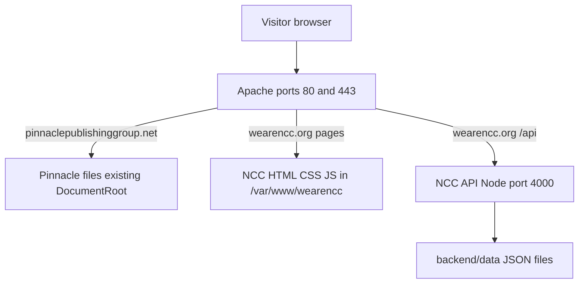

# Complete deployment guide (beginner-friendly)

Follow this document **in order** from top to bottom. You do not need prior Linux or server experience.

**Your server today**

| Item | Value |
|------|--------|
| Google Cloud VM name | `instance-20260502-213133` |
| Public IP | `34.30.208.144` |
| NCC website folder on server | `/var/www/wearencc` |
| Pinnacle (booksales) | Already on **Apache** — do not delete its files |
| NCC API (Node.js) | Runs on `127.0.0.1:4000` (not public; Apache proxies `/api`) |

**What you are building**



---

## Table of contents

1. [Words you will see](#1-words-you-will-see)
2. [What runs where (file map)](#2-what-runs-where-file-map)
3. [Before you start (checklist)](#3-before-you-start-checklist)
4. [Phase A — DNS and Google Cloud firewall](#phase-a--dns-and-google-cloud-firewall)
5. [Phase B — Log into the server (SSH)](#phase-b--log-into-the-server-ssh)
6. [Phase C — Install required software](#phase-c--install-required-software)
7. [Phase D — Pinnacle HTTPS only (do not move booksales files)](#phase-d--pinnacle-https-only-do-not-move-booksales-files)
8. [Phase E — Upload the NCC project to the server](#phase-e--upload-the-ncc-project-to-the-server)
9. [Phase F — Create config files on the server (not in Git)](#phase-f--create-config-files-on-the-server-not-in-git)
10. [Phase G — Install and start the NCC API (backend)](#phase-g--install-and-start-the-ncc-api-backend)
11. [Phase H — Tell Apache about wearencc.org](#phase-h--tell-apache-about-wearenccorg)
12. [Phase I — HTTPS certificates (both domains)](#phase-i--https-certificates-both-domains)
13. [Phase J — Final tests in the browser](#phase-j--final-tests-in-the-browser)
14. [Phase K — First admin login and site settings](#phase-k--first-admin-login-and-site-settings)
15. [Phase L — Updating the site later (redeploy)](#phase-l--updating-the-site-later-redeploy)
16. [Troubleshooting](#troubleshooting)
17. [Quick reference tables](#quick-reference-tables)

SSL troubleshooting supplement: [deploy-shared-server-ssl.md](./deploy-shared-server-ssl.md)

---

## 1. Words you will see

| Term | Meaning |
|------|---------|
| **VM** | Your virtual computer in Google Cloud (`34.30.208.144`). |
| **SSH** | Secure way to type commands on the VM from your PC. |
| **DNS** | Maps `wearencc.org` to your VM IP (like a phone book). |
| **Apache** | Web server that sends out your HTML pages and HTTPS. |
| **Node / API / backend** | Program that powers admin login, calendar API, prayer chat, uploads. |
| **PM2** | Keeps the Node API running after you close SSH. |
| **DocumentRoot** | Folder Apache serves as the website (for NCC: `/var/www/wearencc`). |
| **Virtual host (vhost)** | Apache config for one domain name. |
| **Certbot** | Free tool for HTTPS certificates (Let’s Encrypt). |
| **ProxyPass** | Apache forwards `/api` requests to Node on port 4000. |

---

## 2. What runs where (file map)

### 2.1 On the server after a full NCC deploy

Everything under **`/var/www/wearencc/`** is the NCC project. Apache serves files from that folder for `wearencc.org`.

| What visitors use | Server path | Comes from |
|-------------------|-------------|------------|
| Home page | `/var/www/wearencc/index.html` | Your Git repo |
| All public pages | `/var/www/wearencc/*.html` | Your Git repo |
| Styles / scripts | `/var/www/wearencc/assets/` | Your Git repo |
| Calendar XML (fallback) | `/var/www/wearencc/assets/data/events.xml` | Your Git repo |
| **Browser API address** | `/var/www/wearencc/assets/config/runtime.json` | **You create on server** (copy from example) |
| Staff admin page | `/var/www/wearencc/admin.html` | Your Git repo |

| What the API uses | Server path | Comes from |
|-------------------|-------------|------------|
| API program | `/var/www/wearencc/backend/src/server.js` | Your Git repo |
| Dependencies | `/var/www/wearencc/backend/node_modules/` | Created by `npm install` on server |
| **Secrets & admin password** | `/var/www/wearencc/backend/.env` | **You create on server** (never commit to Git) |
| Events database | `/var/www/wearencc/backend/data/events.json` | Created by API / import script |
| Site config (admin edits) | `/var/www/wearencc/backend/data/site-config.json` | Created on first API start / admin save |
| Admin users | `/var/www/wearencc/backend/data/users.json` | Created on first API start |
| Prayer inbox | `/var/www/wearencc/backend/data/prayer-inbox.json` | Created when used |
| Uploaded files | `/var/www/wearencc/backend/uploads/` | Created when staff uploads |

| Apache system files (copied from repo once) | Server path | Repo source file |
|---------------------------------------------|-------------|------------------|
| NCC vhost | `/etc/apache2/sites-available/wearencc.org.conf` | `deploy/apache/wearencc.org.conf` |

| PM2 (process manager) | | |
|-----------------------|--|--|
| PM2 config | Uses `deploy/ecosystem.config.cjs` from repo | `deploy/ecosystem.config.cjs` |

### 2.2 Pinnacle (booksales) — leave as-is

Pinnacle files stay in **their existing** Apache `DocumentRoot` (often `/var/www/html` or a custom path). **Do not** put Pinnacle inside `/var/www/wearencc`.

Find Pinnacle’s path:

```bash
sudo apache2ctl -S | grep -i pinnacle
```

### 2.3 Files you do **not** upload to the server

| Do not upload | Why |
|---------------|-----|
| `.git/` | Not needed to run the site; wastes space. |
| `backend/node_modules/` | Rebuilt on server with `npm install`. |
| `backend/.env` | Create fresh secrets on the server only. |
| `assets/config/runtime.json` | Create on server from the example file. |
| `backend/data/*.json` with real data from your PC | Server creates its own production data. |
| `under-construction.html` | Removed; not used in production. |

---

## 3. Before you start (checklist)

- [ ] You can log into [Google Cloud Console](https://console.cloud.google.com/).
- [ ] VM **instance-20260502-213133** is running and IP is **34.30.208.144**.
- [ ] You have the NCC project on your computer (Git clone or ZIP).
- [ ] Domain **wearencc.org** (and **www**) DNS will point to **34.30.208.144**.
- [ ] You chose a **strong admin password** (you will type it into `backend/.env` on the server).
- [ ] You have an email for Let’s Encrypt expiry notices.

**Estimated time:** 2–4 hours first time (mostly waiting on DNS and certificates).

---

## Phase A — DNS and Google Cloud firewall

### A.1 DNS (at your domain registrar)

Log into where you bought **wearencc.org** (GoDaddy, Google Domains, Cloudflare, etc.).

Add **A records**:

| Type | Host / name | Points to | TTL |
|------|-------------|-----------|-----|
| A | `@` (or blank) | `34.30.208.144` | 300–3600 |
| A | `www` | `34.30.208.144` | 300–3600 |

If Pinnacle is not on HTTPS yet, also ensure **pinnaclepublishinggroup.net** and **www** point to **34.30.208.144**.

**Wait 5–60 minutes**, then on your PC:

```powershell
nslookup wearencc.org
```

You should see `34.30.208.144`.

### A.2 Google Cloud firewall

1. Google Cloud Console → **VPC network** → **Firewall**.
2. Ensure rules allow **ingress** to this VM:
   - **tcp:22** (SSH)
   - **tcp:80** (HTTP)
   - **tcp:443** (HTTPS)

Many projects have `default-allow-http` and `default-allow-https`. If the site does not load from the internet, add a rule targeting your VM’s network tag.

---

## Phase B — Log into the server (SSH)

### B.1 Find your zone

On your PC (with [Google Cloud SDK](https://cloud.google.com/sdk/docs/install) installed):

```bash
gcloud compute instances list --filter="name=instance-20260502-213133"
```

Note the **ZONE** column (example: `us-central1-a`).

### B.2 Connect

```bash
gcloud compute ssh instance-20260502-213133 --zone=ZONE
```

Replace `ZONE` with your real zone.

**Or** use the **SSH** button in the Google Cloud VM list (browser terminal).

You should see a prompt like `username@instance-20260502-213133:~$`. All following commands are on the **server** unless stated otherwise.

---

## Phase C — Install required software

Run these on the VM **once** (safe to run again if unsure).

```bash
sudo apt update
sudo apt install -y apache2 git curl ufw ca-certificates certbot \
  python3-certbot-apache build-essential
```

Install **Node.js 20** (required for the API):

```bash
curl -fsSL https://deb.nodesource.com/setup_20.x | sudo -E bash -
sudo apt install -y nodejs
node -v
```

You should see `v20.x.x`.

Install **PM2** (keeps API running):

```bash
sudo npm install -g pm2
pm2 -v
```

Enable Apache modules for NCC (proxy + SSL):

```bash
sudo a2enmod proxy proxy_http headers ssl rewrite
sudo systemctl reload apache2
```

If **nginx** was installed and might conflict:

```bash
sudo systemctl stop nginx 2>/dev/null || true
sudo systemctl disable nginx 2>/dev/null || true
```

Check port 80 is Apache:

```bash
sudo ss -tlnp | grep ':80'
```

---

## Phase D — Pinnacle HTTPS only (do not move booksales files)

Pinnacle is **already live** on HTTP via Apache. **Do not** copy booksales files into `/var/www/wearencc`.

### D.1 Confirm Pinnacle works on HTTP

```bash
curl -I http://pinnaclepublishinggroup.net/
```

Expect `HTTP/1.1 200` and `Server: Apache`.

### D.2 Open firewall on the VM for HTTPS

```bash
sudo ufw allow OpenSSH
sudo ufw allow 'Apache Full'
sudo ufw enable
sudo ufw status
```

### D.3 HTTPS for Pinnacle

Use **Apache** Certbot (not nginx):

```bash
sudo certbot --apache \
  -d pinnaclepublishinggroup.net -d www.pinnaclepublishinggroup.net \
  --agree-tos -m YOUR_EMAIL@example.com --redirect
```

Replace the email. Answer prompts if asked interactively.

Test:

```bash
curl -I https://pinnaclepublishinggroup.net/
```

---

## Phase E — Upload the NCC project to the server

**When:** After Phase C (software installed), **before** creating `.env` or starting the API.

**Goal:** Copy the whole NCC repo into `/var/www/wearencc` on the VM.

### E.1 Create folder and permissions

On the VM:

```bash
sudo mkdir -p /var/www/wearencc
sudo chown -R $USER:$USER /var/www/wearencc
cd /var/www/wearencc
```

### E.2 Option 1 — Git (if repo is on GitHub/GitLab)

```bash
cd /var/www/wearencc
git clone https://YOUR_GIT_HOST/YOUR_USER/YOUR_REPO.git .
```

### E.3 Option 2 — Upload from Windows (no Git on server)

On your **Windows PC**, open PowerShell in the NCC project folder (where `index.html` lives).

Install [rsync via WSL](https://learn.microsoft.com/en-us/windows/wsl/) or use **WinSCP** / **FileZilla** (SFTP to `34.30.208.144`, user = your SSH username).

**Rsync example** (adjust username):

```powershell
cd C:\path\to\ncc
rsync -avz --exclude node_modules --exclude backend/node_modules --exclude .git `
  --exclude backend/data/*.json --exclude assets/config/runtime.json `
  --exclude backend/.env `
  ./ YOUR_LINUX_USER@34.30.208.144:/var/www/wearencc/
```

**WinSCP / FileZilla mapping**

| On your PC (local) | Drop on server (remote) |
|--------------------|-------------------------|
| Entire project **contents** (all files inside repo) | `/var/www/wearencc/` |
| `index.html` | `/var/www/wearencc/index.html` |
| `assets/` folder | `/var/www/wearencc/assets/` |
| `backend/` folder (no `node_modules`, no `.env`) | `/var/www/wearencc/backend/` |
| `deploy/` folder | `/var/www/wearencc/deploy/` |
| All other `.html` pages | `/var/www/wearencc/` |

After upload, on the VM:

```bash
ls -la /var/www/wearencc/index.html
ls -la /var/www/wearencc/backend/package.json
ls -la /var/www/wearencc/deploy/apache/wearencc.org.conf
```

All three should exist.

---

## Phase F — Create config files on the server (not in Git)

**When:** Right after Phase E (files uploaded), **before** `npm install` and PM2.

These files are **created only on the server**. They are listed in `.gitignore` and must not be committed.

### F.1 Frontend: `runtime.json` (connects website to API)

```bash
cd /var/www/wearencc
cp assets/config/runtime.production.example.json assets/config/runtime.json
nano assets/config/runtime.json
```

It must look like this (paths matter):

```json
{
  "apiBase": "/api",
  "prayerChat": {
    "useBackendAi": true,
    "persistThreads": true
  }
}
```

- `"apiBase": "/api"` means the browser calls `https://wearencc.org/api/...` on the **same domain**.
- Apache will forward `/api` to Node (Phase H).

Save and exit (`Ctrl+O`, Enter, `Ctrl+X` in nano).

**Verify:**

```bash
cat /var/www/wearencc/assets/config/runtime.json
```

### F.2 Backend: `.env` (API secrets and admin login)

```bash
cd /var/www/wearencc/backend
cp .env.example .env
```

Generate a long random secret:

```bash
openssl rand -base64 48
```

Copy the output. Edit `.env`:

```bash
nano /var/www/wearencc/backend/.env
```

Example (replace placeholders):

```env
NODE_ENV=production
HOST=127.0.0.1
PORT=4000
TRUST_PROXY=1

JWT_SECRET=paste-the-openssl-output-here
ADMIN_EMAIL=admin@wearencc.org
ADMIN_PASSWORD=YourStrongPasswordHere123!
CORS_ORIGIN=https://wearencc.org,https://www.wearencc.org

OPENAI_API_KEY=
OPENAI_MODEL=gpt-4o-mini
```

| Variable | What it does |
|----------|----------------|
| `HOST=127.0.0.1` | API only listens locally (safer). Apache exposes it via `/api`. |
| `JWT_SECRET` | Signs admin login tokens. Must be long and random. |
| `ADMIN_EMAIL` / `ADMIN_PASSWORD` | **First** staff login at `/admin.html`. |
| `CORS_ORIGIN` | Must use **https://** after SSL is enabled. |
| `OPENAI_API_KEY` | Optional; leave empty for simple prayer replies. |

Lock the file:

```bash
chmod 600 /var/www/wearencc/backend/.env
```

### F.3 Data and upload folders

```bash
mkdir -p /var/www/wearencc/backend/data /var/www/wearencc/backend/uploads
chown -R $USER:$USER /var/www/wearencc/backend/data /var/www/wearencc/backend/uploads
```

---

## Phase G — Install and start the NCC API (backend)

**When:** After Phase F.

### G.1 Install Node packages

```bash
cd /var/www/wearencc/backend
npm install --omit=dev
```

This creates `/var/www/wearencc/backend/node_modules/`. Wait until it finishes (1–3 minutes).

### G.2 Import calendar events from XML (one-time, recommended)

```bash
cd /var/www/wearencc/backend
npm run import-events-xml
```

This reads `/var/www/wearencc/assets/data/events.xml` and writes `backend/data/events.json`.

### G.3 Test API manually (then stop)

```bash
cd /var/www/wearencc/backend
node src/server.js
```

Leave it running. Open a **second** SSH session (new terminal) and run:

```bash
curl -s http://127.0.0.1:4000/api/health
```

**Expected:**

```json
{"status":"ok","service":"ncc-admin-backend"}
```

In the first session press **Ctrl+C** to stop the test server.

If you see an error about `ADMIN_PASSWORD` or `JWT_SECRET`, fix `.env` and try again.

### G.4 Start API with PM2 (production)

```bash
cd /var/www/wearencc/backend
pm2 start ../deploy/ecosystem.config.cjs
pm2 status
```

You should see `ncc-backend` **online**.

```bash
pm2 logs ncc-backend --lines 30
```

Save PM2 so it restarts after reboot:

```bash
pm2 save
pm2 startup
```

Copy the **`sudo env ...`** command that `pm2 startup` prints, paste it, press Enter.

### G.5 Preflight script

```bash
cd /var/www/wearencc
bash deploy/preflight.sh
```

Fix any `[FAIL]` lines before continuing.

**At this point:** API works on the server, but the **public website** may not load `wearencc.org` until Phase H (Apache).

---

## Phase H — Tell Apache about wearencc.org

**When:** After Phase G (API running on 4000), **after** DNS for wearencc points to this VM.

**What this does:** Copies the vhost template from the repo into Apache’s config folder and enables the site.

### H.1 Copy vhost file (repo → system)

```bash
sudo cp /var/www/wearencc/deploy/apache/wearencc.org.conf \
  /etc/apache2/sites-available/wearencc.org.conf
```

| Repo file | Server file |
|-----------|-------------|
| `deploy/apache/wearencc.org.conf` | `/etc/apache2/sites-available/wearencc.org.conf` |

### H.2 Enable site and reload Apache

```bash
sudo a2ensite wearencc.org.conf
sudo apache2ctl configtest
```

Must say **Syntax OK**.

```bash
sudo systemctl reload apache2
```

### H.3 Confirm both sites appear

```bash
sudo apache2ctl -S
```

You should see entries for **wearencc.org** and Pinnacle’s hostname.

### H.4 Test HTTP (before SSL)

```bash
curl -I http://wearencc.org/
curl -s http://wearencc.org/api/health
```

- First command: `200` or `301`.
- Second: JSON health response (proves Apache → Node proxy works).

If you see Pinnacle’s content on `wearencc.org`, DNS or vhost is wrong — fix before SSL.

**Home page:** Apache must use `index.html` as default (already in the vhost template: `DirectoryIndex index.html`). Do **not** set `under-construction.html` as the site index.

---

## Phase I — HTTPS certificates (both domains)

**When:** HTTP works for each domain (Phases D and H).

### I.1 NCC certificate

```bash
sudo certbot --apache \
  -d wearencc.org -d www.wearencc.org \
  --agree-tos -m admin@wearencc.org --redirect
```

### I.2 Restart API (CORS must match https)

```bash
pm2 restart ncc-backend
```

### I.3 Test HTTPS

```bash
curl -I https://wearencc.org/
curl -s https://wearencc.org/api/health
curl -s https://wearencc.org/assets/config/runtime.json
```

### I.4 Auto-renewal test

```bash
sudo certbot renew --dry-run
```

---

## Phase J — Final tests in the browser

Open these URLs on your phone or PC:

| # | URL | Expect |
|---|-----|--------|
| 1 | https://wearencc.org/ | Home page, padlock icon |
| 2 | https://wearencc.org/livestream.html | Livestream page |
| 3 | https://wearencc.org/events.html | Calendar |
| 4 | https://wearencc.org/admin.html | Admin login form |
| 5 | https://pinnaclepublishinggroup.net/ | Pinnacle site (unchanged) |

**API test in browser:** open DevTools → Network → visit admin and sign in; requests should go to `https://wearencc.org/api/...` not another host.

---

## Phase K — First admin login and site settings

**When:** Phase J passes.

1. Go to **https://wearencc.org/admin.html**
2. Email: value of `ADMIN_EMAIL` from `.env`
3. Password: value of `ADMIN_PASSWORD` from `.env`
4. After login, open **Site configuration**
5. Click **Reload from server** → review JSON → **Save changes**

That writes `/var/www/wearencc/backend/data/site-config.json` and syncs fallbacks under `assets/data/`.

**Change admin password later:** editing `.env` alone does **not** update the password after first run. You must reset via `users.json` or a future admin tool.

**Brand guide (staff only):** links appear in admin toolbar after login → Brand guide / Brand hub.

---

## Phase L — Updating the site later (redeploy)

**When:** You changed HTML/CSS/JS or backend code in Git.

### L.1 What to upload again

| Upload (overwrite) | Do not overwrite |
|--------------------|------------------|
| `*.html`, `assets/`, `backend/src/`, `deploy/` | `backend/.env` |
| | `assets/config/runtime.json` |
| | `backend/data/*.json` |
| | `backend/uploads/*` |

### L.2 Commands on server

```bash
cd /var/www/wearencc
git pull
# OR rsync from PC again with same excludes as Phase E

cd backend
npm install --omit=dev
pm2 restart ncc-backend
```

If Apache template changed:

```bash
sudo cp /var/www/wearencc/deploy/apache/wearencc.org.conf \
  /etc/apache2/sites-available/wearencc.org.conf
sudo apache2ctl configtest && sudo systemctl reload apache2
```

---

## Troubleshooting

| Problem | What to check | What to do |
|---------|---------------|------------|
| `wearencc.org` shows wrong site | DNS, `apache2ctl -S` | Fix A records; enable `wearencc.org.conf` |
| Blank page | `index.html` exists? | `ls /var/www/wearencc/index.html` |
| Admin login fails | API running? | `pm2 status`; `curl -s http://127.0.0.1:4000/api/health` |
| Admin login fails | Wrong password | Use `.env` values from **first** API start |
| `/api/health` 502 | Node down | `pm2 logs ncc-backend`; fix `.env` |
| CORS error in browser | HTTP vs HTTPS | `CORS_ORIGIN=https://wearencc.org,...`; `pm2 restart` |
| `runtime.json` 404 | File missing | Phase F.1 |
| Pinnacle HTTPS broken | Use Apache certbot | [deploy-shared-server-ssl.md](./deploy-shared-server-ssl.md) |
| Port 443 closed | GCP firewall + ufw | Phase D.2, `Apache Full` |

**Useful commands**

```bash
pm2 status
pm2 logs ncc-backend --lines 50
sudo apache2ctl -S
sudo tail -n 50 /var/log/apache2/wearencc-error.log
curl -s http://127.0.0.1:4000/api/health
curl -s https://wearencc.org/api/health
```

---

## Quick reference tables

### Deploy order (one line per phase)

| Order | Phase | Summary |
|-------|-------|---------|
| 1 | A | DNS + GCP firewall |
| 2 | B | SSH login |
| 3 | C | Install Apache, Node, PM2, Certbot |
| 4 | D | Pinnacle HTTPS (optional if already done) |
| 5 | E | Upload repo → `/var/www/wearencc` |
| 6 | F | Create `runtime.json` + `.env` on server |
| 7 | G | `npm install`, import events, PM2 start API |
| 8 | H | Copy Apache vhost, enable site, test HTTP |
| 9 | I | Certbot HTTPS for wearencc |
| 10 | J–K | Browser tests + admin login |

### How the API connects to the website

1. Visitor opens `https://wearencc.org/admin.html`.
2. Page loads `assets/js/site.js` → reads `assets/config/runtime.json` → sets API base to `/api`.
3. Browser requests `https://wearencc.org/api/auth/login`.
4. Apache receives request on port 443, `ProxyPass` sends to `http://127.0.0.1:4000/api/auth/login`.
5. Node handles login, writes `backend/data/users.json` on first startup.

### Public API routes (via Apache `/api`)

| Purpose | Method | Path |
|---------|--------|------|
| Health check | GET | `/api/health` |
| Public site config | GET | `/api/public/site-config` |
| Published events | GET | `/api/events` |
| Prayer chat | POST | `/api/prayer/chat` |
| Admin login | POST | `/api/auth/login` |
| Admin events | GET/POST/PATCH | `/api/events` (with token) |

Admin routes require `Authorization: Bearer <token>` from login.

---

## Optional: systemd instead of PM2

File: `deploy/systemd/ncc-backend.service` — copy to `/etc/systemd/system/`, edit paths, then:

```bash
sudo systemctl enable --now ncc-backend
```

Use **either** PM2 **or** systemd, not both.

---

## Appendix — Every public HTML page (PC → server)

Upload each file to **`/var/www/wearencc/`** with the **same filename**. Visitors open `https://wearencc.org/FILENAME`.

| File in your repo | URL after deploy |
|-------------------|------------------|
| `index.html` | https://wearencc.org/ |
| `about.html` | https://wearencc.org/about.html |
| `events.html` | https://wearencc.org/events.html |
| `livestream.html` | https://wearencc.org/livestream.html |
| `give.html` | https://wearencc.org/give.html |
| `contact.html` | https://wearencc.org/contact.html |
| `blog.html` | https://wearencc.org/blog.html |
| `messages.html` | https://wearencc.org/messages.html |
| `ministries.html` | https://wearencc.org/ministries.html |
| `mens-ministry.html` | https://wearencc.org/mens-ministry.html |
| `youth-ministry.html` | https://wearencc.org/youth-ministry.html |
| `statement-of-faith.html` | https://wearencc.org/statement-of-faith.html |
| `anthony-inspiration.html` | https://wearencc.org/anthony-inspiration.html |
| `legacy-content.html` | https://wearencc.org/legacy-content.html |
| `admin.html` | https://wearencc.org/admin.html (staff login) |
| `status.html` | https://wearencc.org/status.html (service health / uptime) |
| `brand.html`, `colors.html`, `header-preview.html` | Staff/brand tools (linked from admin after login) |

**`assets/` folder** — upload the whole directory to `/var/www/wearencc/assets/` (CSS, JS, images, `assets/data/events.xml`, etc.). Do not skip subfolders.

---

## Optional: nginx-only deploy

This VM uses **Apache** for Pinnacle and NCC. The files under `deploy/nginx/` are for a different hosting layout only. Do not enable nginx on ports 80/443 unless you plan a full migration ([deploy-shared-server-ssl.md](./deploy-shared-server-ssl.md)).
